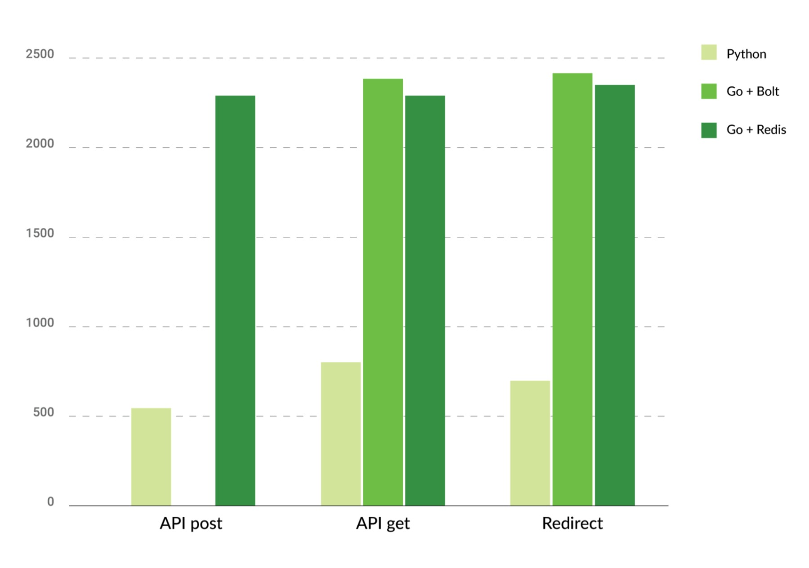
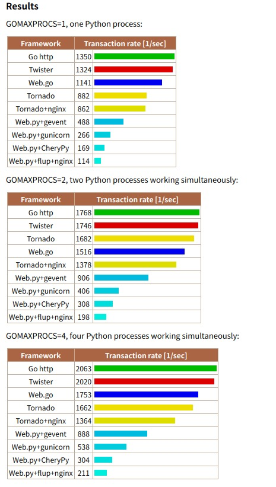

# Go Python サーバー比較

### パフォーマンス比較
- [General benchmark](https://benchmarksgame-team.pages.debian.net/benchmarksgame/fastest/go-python3.html)

- [Collatz数列のベンチマーク](https://rheotommy.hatenablog.com/entry/2020/07/18/205343)
  - Go is 10~25x faster

- APIレスポンス
  - Go is 4x faster [link](https://djangostars.com/blog/my-story-with-golang/)

   

  
   

  *[the source](https://djangostars.com/blog/my-story-with-golang/)

   

  - web framework benchmark : Go is 1.5x~11x faster

  

   

  *[the source](http://ziutek.github.io/web_bench/)

- Switched from Python to Go
  - [thought](https://softwareengineeringdaily.com/2021/03/03/why-we-switched-from-python-to-go/)

